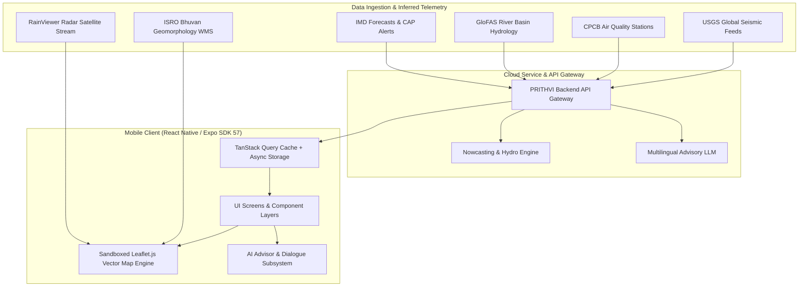
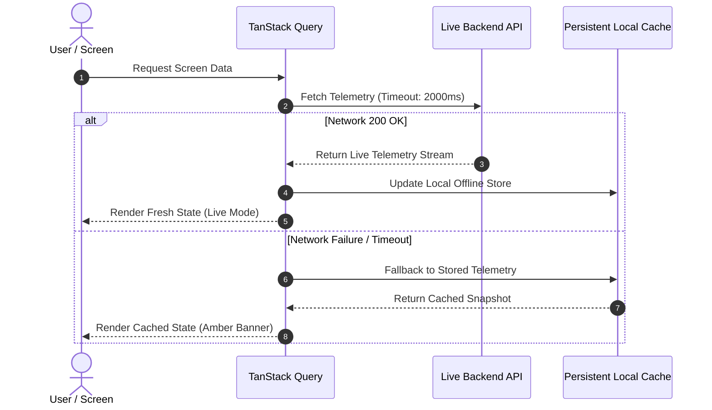

# PRITHVI-AI (पृथ्वी-AI / পৃথিবী-AI)

**Hyperlocal Climate Intelligence, Meteorological Nowcasting & Multi-Hazard Geospatial Platform**

[](https://reactnative.dev/)
[](https://expo.dev/)
[](https://www.typescriptlang.org/)
[](https://tanstack.com/query)
[](https://www.i18next.com/)
[](LICENSE)

PRITHVI-AI is a high-performance cross-platform mobile application designed for hyperlocal environmental monitoring, multi-hazard early warning, and climate intelligence across South Asia. Engineered with an offline-resilient architecture, it aggregates satellite telemetry, meteorological models, hydrological flood forecasts, air quality sensors, and remote sensing imagery into an intuitive, accessible dashboard with native multilingual AI assistance.

---

## System Architecture

The application implements a multi-tier resilient architecture designed to maintain operational stability under fluctuating network conditions in regional and rural deployments.



### Data Resilience Strategy

To guarantee zero UI blocking in low-connectivity areas, client network transactions operate through a three-tier fallback pipeline:



---

## Core Capabilities

```
+-----------------------------------------------------------------------------+
|                           PRITHVI-AI MOBILE SUITE                           |
+-----------------+------------------+-----------------+----------------------+
| Home Dashboard  | Analytics Engine | Geospatial Maps | Multi-Hazard Data    |
| - Sky & Temp    | - Storm Matrix   | - Leaflet Core  | - 7-Day Multi-Metric |
| - Rain Timeline | - Kalman Radar   | - Radar Tiles   | - River Stage Alert  |
| - CAP Warnings  | - Evapotranspir. | - State Borders | - AQI & Particulates |
| - Seismic Watch | - Soil Moisture  | - AWS Stations  | - Trilingual Advisor |
+-----------------+------------------+-----------------+----------------------+
```

### 1. Atmospheric Nowcasting & Live Meteorology
- **Precipitation Prediction**: Hourly precipitation charts with discrete probability distributions across 6 to 8-hour lookaheads.
- **Dynamic Sky Telemetry**: Real-time ambient temperature, diurnal temperature ranges, relative humidity, barometric trend, and dew point.
- **Wind Vector Profiling**: Multi-interval gust speeds, directional heading, and micro-climate shear analysis.

### 2. Multi-Hazard Disaster Monitoring & Early Warning
- **Common Alerting Protocol (CAP)**: Live ingestion of severe weather bulletins, thunderstorm advisories, cyclone paths, and heatwave alerts.
- **Hydrological River Flood Risk**: Integration with GloFAS river discharge matrices to track baseline vs. critical stage exceedance.
- **Air Quality Telemetry (AQI)**: Real-time particulate classification (PM2.5, PM10, $NO_2$, $SO_2$) with health hazard advisories.
- **Seismic Event Tracking**: Proximity-filtered earthquake alerts with hypocenter coordinates and magnitude scoring.

### 3. Geospatial & Remote Sensing Intelligence
- **API-less Leaflet Framework**: Custom map canvas sandboxed inside React Native `WebView`, eliminating reliance on proprietary Google Maps APIs and preventing native crashing.
- **Radar Overlays**: Real-time RainViewer Doppler precipitation radar mosaic tiles with playback controls.
- **Remote Sensing Layers**: Custom Web Map Service (WMS) support, including ISRO Bhuvan geomorphological and terrain layers.
- **District Telemetry Nodes**: Pinpointed automatic weather stations (AWS) with localized telemetry inspect panels.

### 4. Analytical Forecasts & Hydro-Climatic Models
- **Extended 7-Day Horizons**: Multi-parameter daily projections including temperature curves, precipitation likelihood, and soil moisture saturation.
- **Evapotranspiration Index**: Reference crop and environmental water consumption curves for sustainable water balance management.
- **Historical Trends**: Comparative variance plots contrasting 24-hour readings against regional baseline records.

### 5. Multilingual AI Climate Advisor
- **Native Trilingual Execution**: Instant on-the-fly language switching across English, Hindi (हिंदी), and Bengali (বাংলা).
- **Curated Prompt Matrix**: Quick-action presets for localized hazard status, weather outlooks, rainfall predictions, and safety protocols.
- **Verified Provenance**: Direct attribution to scientific reporting bodies (IMD, CPCB, GloFAS, USGS).

---

## Mathematical & Scientific Formulations

PRITHVI-AI integrates validated physical models for atmospheric nowcasting and surface hydrology:

### 1. Between-Scene Kalman Nowcasting Filter
Calculates smoothed rain-rate transition estimations ($\hat{x}_k$) across satellite scan intervals to identify rapidly developing convective cells:

$$\hat{x}_k = \hat{x}_{k|k-1} + K_k \left( z_k - H \hat{x}_{k|k-1} \right)$$

- **Scan Integration**: 15-minute geostationary satellite updates (INSAT-3D/3DR).
- **Adaptive Gain ($K_k$)**: Dynamically optimized against ground automatic weather station telemetry to reduce false positives.

### 2. FAO-56 Penman-Monteith Evapotranspiration ($ET_0$)
Standardized reference evapotranspiration modeling for catchment-scale water budget estimation:

$$ET_0 = \frac{0.408 \Delta (R_n - G) + \gamma \frac{900}{T + 273} u_2 (e_s - e_a)}{\Delta + \gamma (1 + 0.34 u_2)}$$

| Parameter | Definition | Units |
| :--- | :--- | :--- |
| $R_n$ | Net surface radiation | $\text{MJ}\cdot\text{m}^{-2}\cdot\text{day}^{-1}$ |
| $G$ | Soil heat flux density | $\text{MJ}\cdot\text{m}^{-2}\cdot\text{day}^{-1}$ |
| $T$ | Mean daily air temperature at 2 m | $^\circ\text{C}$ |
| $u_2$ | Wind speed measured at 2 m elevation | $\text{m}\cdot\text{s}^{-1}$ |
| $e_s - e_a$ | Saturation vapor pressure deficit | $\text{kPa}$ |
| $\Delta$ | Slope of saturation vapor pressure curve | $\text{kPa}\cdot^\circ\text{C}^{-1}$ |
| $\gamma$ | Psychrometric constant | $\text{kPa}\cdot^\circ\text{C}^{-1}$ |

### 3. GloFAS Hydrological Exceedance Model
Computes catchment discharge anomalies against historical return period thresholds (2-year, 5-year, and 20-year flood markers) to deliver automated alert stages.

---

## Screen Capabilities & Routing

| Screen | Route | Key Data Feeds | Visual Elements |
| :--- | :--- | :--- | :--- |
| **Home** | `app/(tabs)/index.tsx` | Ambient conditions, Rain timeline, CAP alerts, Seismic | SVG Precipitation Bars, Hazard Cards, Metric Grids |
| **Analytics** | `app/(tabs)/analytics.tsx` | 7-day extended forecast, $ET_0$, Soil moisture | Multi-axis SVG Curves, Soil Waves, Hourly Breakdown |
| **Maps** | `app/(tabs)/maps.tsx` | Doppler radar tiles, Bhuvan WMS, Telemetry stations | Leaflet.js WebView Canvas, Layer Toggles, Station Pins |
| **Data** | `app/(tabs)/data.tsx` | IMD-CAP bulletins, River basin discharge, AQI nodes | Hazard Classification Grid, Metric Trend Tables |
| **Advisor** | `app/(tabs)/chat.tsx` | Multilingual AI advisory model, Source references | Central Conversation Card, Language Switcher, Action Pills |
| **Settings** | `app/(tabs)/settings.tsx` | User preferences, Location overrides, Appearance | Theme Toggle (Light/Dark), Metric Selectors |

---

## Project Structure

```
PRITHVI-AI-Android-App/
├── app/                        # Expo Router File-Based Routing
│   ├── _layout.tsx             # Root Provider (React Query, i18n, SafeArea)
│   └── (tabs)/                 # Bottom Tab Navigator Screens
│       ├── _layout.tsx         # Navigation Bar & Lucide Icons
│       ├── index.tsx           # Home Dashboard
│       ├── analytics.tsx       # Predictive Analytics & Charts
│       ├── maps.tsx            # Leaflet Geospatial View
│       ├── data.tsx            # Hazard Feeds & Environmental Data
│       ├── chat.tsx            # Trilingual AI Climate Advisor
│       └── settings.tsx        # System & Location Configurations
├── src/                        # Application Source Code
│   ├── api/                    # Networking & Telemetry Ingestion Layer
│   │   ├── client.ts           # Barrel Export for API Hooks
│   │   ├── endpoints.ts        # Service Endpoint Definitions
│   │   ├── hooks.ts            # TanStack Query Custom Hooks
│   │   ├── http.ts             # Resilient Fetch Pipeline with Timeout
│   │   └── weatherGridClient.ts# Gridded Precipitation Engine
│   ├── components/             # Reusable UI Component Library
│   │   ├── AuthModal.tsx       # Authentication Dialog
│   │   ├── LocationPicker.tsx  # Geographic Coordinate & Pin Selector
│   │   └── SmoothFadeView.tsx  # Optimized Animated Transition View
│   ├── context/                # React Context State Providers
│   │   ├── AuthContext.tsx     # Session & Profile Context
│   │   ├── LocationContext.tsx # User Coordinates & Geocoding State
│   │   ├── ThemeContext.tsx    # Light/Dark Design Tokens
│   │   └── TabVisibilityContext.tsx # Dynamic Tab Display Controls
│   ├── features/               # Feature-Specific Implementations
│   │   ├── home/               # Dashboard Metric Cards & SVG Visualizations
│   │   └── map/                # Leaflet WebView Shell & GeoJSON Boundaries
│   ├── i18n/                   # Multi-Language Localization Engine
│   │   └── index.ts            # English, Hindi, and Bengali String Catalogs
│   ├── theme/                  # Design Tokens & Theming Standards
│   │   └── tokens.ts           # Color System, Typography, Spacing
│   ├── types/                  # TypeScript Interfaces & Data Contracts
│   │   └── index.ts            # Domain Model Definitions
│   └── utils/                  # Utility Functions & Formatting
│       └── localize.ts         # Regional Numeral & Date String Converters
├── android/                    # Native Android Project & Build Files
├── assets/                     # Application Icons, Splash, and Logos
├── app.config.ts               # Dynamic Expo Configuration
├── package.json                # Project Dependencies & Build Scripts
└── tsconfig.json               # Strict TypeScript Configuration
```

---

## Tech Stack & Dependencies

| Category | Library | Purpose |
| :--- | :--- | :--- |
| **Core Framework** | [Expo SDK 57](https://expo.dev/) | Managed React Native development platform |
| **Routing** | [Expo Router v3](https://docs.expo.dev/router/introduction/) | File-system based typed navigation |
| **Language** | [TypeScript 5.3](https://www.typescriptlang.org/) | End-to-end static type safety |
| **Server State & Cache** | [TanStack Query v5](https://tanstack.com/query) | Asynchronous cache, background refetch, and retry logic |
| **Persistent Storage** | [AsyncStorage](https://react-native-async-storage/async-storage) | On-device key-value persistence for offline support |
| **Geospatial Engine** | [Leaflet.js](https://leafletjs.com/) via `react-native-webview` | Embedded vector and raster map rendering |
| **Vector Visualizations** | [react-native-svg](https://github.com/software-mansion/react-native-svg) | Responsive custom charts and metric curves |
| **Iconography** | [lucide-react-native](https://lucide.dev/) | Standardized iconography |
| **Internationalization** | [i18next](https://www.i18next.com/) & `react-i18next` | Localization across EN, HI, and BN |

---

## Getting Started

### Prerequisites
- **Node.js**: `v20.x` or higher
- **Package Manager**: `npm` (comes with Node)
- **Java Development Kit (JDK)**: OpenJDK 17 (for native Android builds)
- **Android Studio**: Android SDK Build-Tools 34.0.0+ (optional, for native builds)

### 1. Clone the Repository
```bash
git clone https://github.com/NetRunnerXD/PRITHVI-AI-Android-App.git
cd PRITHVI-AI-Android-App
```

### 2. Install Dependencies
```bash
npm install
```

### 3. Environment Configuration
Create a local `.env` file from the provided example template:

```bash
cp .env.example .env
```

Default configuration variables:

```env
# Backend API Base URL
EXPO_PUBLIC_API_BASE=https://prithvi-ai-api.onrender.com

# Default Regional Coordinates (South Asia Anchor)
EXPO_PUBLIC_DEFAULT_LAT=22.0667
EXPO_PUBLIC_DEFAULT_LON=88.0698
```

### 4. Run Development Server
```bash
# Start Metro bundler with cleared cache
npx expo start -c

# Launch directly on connected Android device / emulator
npm run android
```

> **Note on Native Device Features**: For native location hardware and speech recognition integration, compile the native Android folder directly:
> ```bash
> npx expo prebuild --clean
> npx expo run:android
> ```
> For detailed Android build setup, see [`SETUP-ANDROID.md`](SETUP-ANDROID.md).

---

## Data Provenance & References

PRITHVI-AI synthesizes data from certified meteorological, environmental, and earth observation institutions:

- **India Meteorological Department (IMD)**: Meteorological nowcasting models, severe weather warnings, and Common Alerting Protocol (CAP) bulletins.
- **Global Flood Awareness System (GloFAS / Copernicus)**: Operational river discharge forecasts and hydrological runoff anomaly indices.
- **Central Pollution Control Board (CPCB)**: Continuous Ambient Air Quality Monitoring (CAAQM) telemetry.
- **United States Geological Survey (USGS)**: Real-time seismic event tracking and earthquake epicenter metrics.
- **RainViewer**: Global radar mosaic composite feeds.
- **ISRO Bhuvan**: Geospatial landcover and geomorphology Web Map Services (WMS).
- **Agmarknet (DAC&FW)**: Regional mandi agricultural commodity pricing indices.

---

## Quality Standards & Contributing

Contributions that enhance accuracy, performance, and accessibility are welcome.

### Branching Strategy
- `main`: Production-ready release branch.
- `feat/<feature-name>`: Discrete feature implementations.
- `fix/<bug-name>`: Bug fixes and performance optimizations.

### Code Quality Verification
Before submitting a pull request, verify that TypeScript compiles with zero errors:

```bash
npm run typecheck
# or: npx tsc --noEmit
```

### Commit Guidelines
Maintain concise, imperative commit messages describing the intent of the change:
```bash
# Example
git commit -m "add river discharge threshold indicators to hazard card"
```

---

## License

This project is licensed under the [MIT License](LICENSE).
